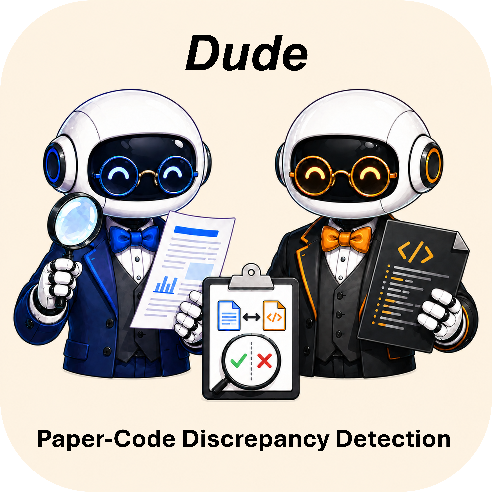

<div align="center">

  
   <h1 align="center">Dude: A Dual-Detection Multi-Agent System </br> for Paper-Code Discrepancy Detection </h1>

⭐️ **Automatically Detecting Paper-Code Inconsistencies** ⭐️

| ✅ **Multi-LLM Platform Support** | ⏯️ **Support Task Resuming** | 🌎 **Offline & Online Compatibility** |

</div>

---


## 📝 Overview

**Dude** is a multi-agent system designed to automatically detect discrepancies between academic papers and their corresponding code implementations. It adopts a dual-detection architecture in which multiple specialized agents collaborate through granularity-aligned negotiation and a two-stage salience-filtering mechanism to identify inconsistencies, missing implementations, and deviations from the descriptions in the paper.

### ✨ Key Features

- **Multi-Agent Architecture**: Specialized agents for dual-detection modes (paper-oriented, code-oriented).
- **Multi-LLM Platform Support**: Configurations for Claude, Deepseek, GPT, and Kimi models.
- **Support resuming interrupted tasks**: Structured three-stage pipeline for systematic discrepancy detection that supports interrupted task recovery.
- **Offline & online paper compatibility**: Handles both local papers and online papers via URL.

## 🔥 News

- **[2026.08.28]** 🚩 **[Features Update]** We split the **Paper Claimer** Agent into two specialized agents: **Paper Claimer** and **Paper Searcher**. The former extracts claims from research papers, while the latter searches for external evidence to support those claims. This change helps prevent performance degradation caused by overly long contexts in a single agent.
- **[2026.08.28]** 🚩 **[Features Update]** We split the **Code Verifier** Agent into two specialized agents: **Code Mapper** and **Code Verifier**. The former maps claims to the codespace, while the latter verifies the paper-code discrepancy. This change helps prevent performance degradation caused by overly long contexts in a single agent.
- **[2026.08.21]** 🎉 **Dude is now open source!** The codebase includes the full implementation of the framework, configurations for mainstream agent platforms (ChatGPT, Claude Code, and OpenCode) as well as the prompts used by the system.
- **[2026.08.20]** 🎉 **Dude has been accepted as a Main Conference paper in EMNLP 2026!** See you in Budapest 🇭🇺! 

## 🖼️ Project Structure

```
Dude/
├── agents/                             # Multi-LLM agent configurations
│   ├── Claude/                         # Claude model agents
│   │   ├── code_claimer.md             # Extracts claims from code
│   │   ├── code_mapper.md              # Maps research claims to the codebase
│   │   ├── code_negotiator.md          # Negotiates code claim validity
│   │   ├── code_verifier.md            # Verifies code claims
│   │   ├── paper_claimer.md            # Extracts claims from papers
│   │   ├── paper_searcher.md           # Searches for external evidence 
│   │   ├── paper_negotiator.md         # Negotiates paper claim validity
│   │   └── paper_verifier.md           # Verifies paper claims
│   ├── Deepseek/                       # Deepseek model agents (same structure)
│   ├── GPT/                            # GPT model agents (.toml)
│   └── Kimi/                           # Kimi model agents
│
├── orchstrator-prompt/                  # Orchestrator workflow prompts
│   ├── orchestrator_main_prompt.md             # Initialization Prompt
│   ├── orchestrator_initialization_prompt.md   # Stage 1: Initialize analysis
│   ├── orchestrator_negotiation_prompt.md      # Stage 2: Resolution negotiation
│   └── orchestrator_code-summary_prompt.md     # Stage 3: Generate summary
│
├── info.md                              # Configuration metadata
├── README.md                            # This file
```

## ⚙️ Installation Requirements

- **A supported agent platform**: Install and authenticate at least one of ChatGPT, Claude Code, or OpenCode before starting the workflow.

- **jq**: Required for processing and manipulating JSON files. Install via:
  ```bash
  # macOS
  brew install jq
  
  # Linux
  sudo apt-get install jq
  ```


### 1. Clone the Dude repository

For a new installation, clone the repository and enter its root directory:

```bash
git clone https://github.com/VinnyLiu0817/Dude.git
cd Dude
```

### 2. Copy the matching agents into the platform root

Dude stores platform-specific agent definitions under `agents/`. Copy all the agent files (.md or .toml) that matches the platform you plan to use into that platform's `agents` directory. The commands below install the agents globally for the current user:

| Platform | Dude source | Platform agent directory |
| --- | --- | --- |
| Codex | `agents/GPT/` | `~/.codex/agents/` |
| Claude Code | `agents/Claude/` | `~/.claude/agents/` |
| OpenCode | `agents/Kimi/` or `agents/Deepseek/` | `~/.config/opencode/agents/` |

The platform agent directory should be installed by default if you successfully install the agent platform. Otherwise, you can manully creat the directory.

```bash
# Codex
mkdir -p ~/.codex/agents

# Claude Code
mkdir -p ~/.claude/agents

# OpenCode
mkdir -p ~/.config/opencode/agents
```

If you want the agents to be available only in a particular project, copy them into that project's platform directory instead (for example, `<project-root>/.claude/agents/` or `<project-root>/.opencode/agents/`). 


## 💫 Quick Start

### Step 1. Paper/Code setup

Edit `info.md` to configure:

```markdown
paper_path = "<path or url to paper PDF>"
code_path = "<path to code repository>"
Maximum_round for negotiation: 2
```

### Step 2. LLM selection

Choose your preferred LLM provider by selecting agents from:
- **Claude**: `agents/Claude/`
- **Deepseek**: `agents/Deepseek/`
- **GPT**: `agents/GPT/` (TOML format)
- **Kimi**: `agents/Kimi/`

Each provider folder contains pre-configured agent prompts for all eight roles (4 code agents+ 4 paper agents).

### Step 3. Initialize the detection workflow

To initialize the workflow, user can either paste the contents of ''<orchestrator_main_prompt.md>'' into Codex, Claude Code, or OpenCode, or have the agent read this markdown file directly.

## 📕 Important Notes

### 1. Paper Upload with MinerU
MinerU uploads may fail during peak hours. If you encounter upload failures:
- Change `paper_path` to `paper_url` in `info.md`
- Provide a direct URL to the paper instead of a local file path
- Example:
  ```markdown
  paper_url = "https://arxiv.org/pdf/XXXX.XXXXX.pdf"
  ```

### 2. Codex Agent Configuration
When using **Codex** as your agent framework, ensure stable agent activation by configuring your agent information:
- Add your agent credentials to `~/.codex/config.toml`
- This guarantees stable and reliable agent activation
- Without proper configuration, agents may fail to initialize consistently
